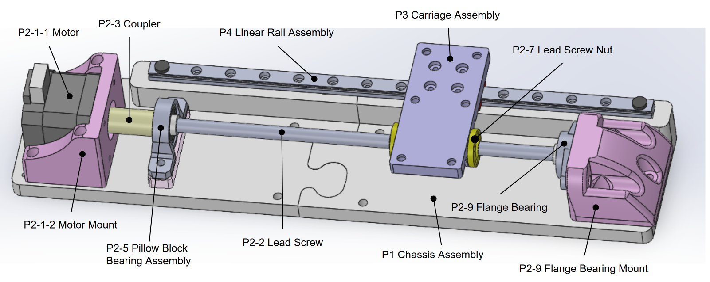

# Single Axis Slider Project

A simple single-axis CNC motion system for learning about the process of building a custom CNC machine. 

## Project objectives (checked when achieved)
- [x] The purpose of this project is to build a cheap motorized linear axis, and to play with different mechanical, electrical, and control options.
- [x] The system should consist of a stepper motor that moves a carriage back and forth along a single axis.
- [x] It should be possible to move the carriage around to specific positions on the axis based on controls from the user.
- [x] A serial/debug interface should be built to let the user try out different settings, or run specific functions on the controller.
- [x] The system should be able to execute standard motion profiles with controlled acceleration and velocity.
- [ ] The controller should be able to run simple g-code programs.
- [ ] The system should include limit switches with auto-homing and collision prevention features.
- [ ] The system should host a web server to lay the groundwork for a user-friendly HMI.
- [ ] The serial/debug interface should be made accessible through the web server via telnet or similar.
- [ ] A web app architecture should be developed to serve an interface to clients which interacts smoothly with the server/controller.
- [ ] A user-friendly HMI should be implemented to jog the motor, home, go to a position, run a g-code command, upload a g-code program, or pause or resume a g-code program that is currently running.
- [ ] The axis should be semi-rigid, so we can pretend that we will use this to mill wood, aluminum, or brass.
- [x] The project should include some basic level of documentation so that readers can get a reasonably good idea of how things work and what's going on.
- [ ] The documentation should be sufficient that someone else could replicate this work, and build the exact same thing.
- [ ] The documentation should be sufficient that a person trying to replicate this work should be able to follow the sequence of decisions that were originally made to build this thing.
- [ ] Use this project as the spindle-carrying X-axis for a full 3-axis CNC mill.

## Files in this repository
Files in this repository are numbered, so that they can be referenced by their document number. Folders in this repository are given letters. Document number 1 in folder C is called document C.1. 
Some folders use part numbers instead of the conventional folder letters. The Part files in folder A and the CAD files in folder B are both examples of this. The CAD folder breaks down it's documents in a slightly different way to keep a clearer revision history.
* **1 - Assembly Definition Document**: This document has the list of parts, and the list of purchase orders and work items that need to be done to build the project. I am working on replacing this Document with MD files such as 3 - Parts.md.
* **3 - Parts.md**: Lists the ID of all parts with a short description and a reference to diagrams that show this part. Includes purchase links and other important details for each part.
* **4 - Ports.md**: TODO: A "Port" is a feature on a part that can be connected to something. It can be a pin/wiring terminal, or it can be a mechanical feature that mates to another mechanical feature on another part. This file details all the ports for each part, which is required to understand document "5 - Connections.md". You often need to look in folder "A - Parts" for a part's "Port Diagram", which shows the name of each port when none is written directly on the part.
* **5 - Connections.md**: TODO: Lists all of the connections between the 'Ports' on various parts. These connections may be made with wires, pipes, fasteners, or others. Notes are given about each connection.
* **6 - TODO.md**: A TODO list to help remind me of the endless pile of tasks yet-to-be-done.
* **Folder A - Parts**: This folder contains detailed information and documents relating to each part. The sub-folders in here are named after the part numbers outlined in document 1 (the assembly definition document). CAD files are not kept in here.
* **Folder B - CAD**: This folder contains all the CAD files, including STL and MDF files used for 3D printing. This is kept seperate from the parts folder to help streamline the CAD modeling workflow. Unfortunately that will make it a bit more of a pain to browse the repository when browsing through parts; you may need to keep one window open for folder A, and another window open for folder B.  Similarly to folder A, all the sub-folders are named after the related part number defined in document 1. I try to keep the STL file for every version of the part that I ever printed, so you can see the progression of changes as I try things and adjust.
* **Folder C - Videos**: As I make YouTube videos to demonstrate different aspects or snapshots of the project, I'll list them here with links and a brief description.
* **Folder D - Diagrams**: All diagrams from document 2 will get exported into here in PDF format. Each diagram will be identified with its diagram number.

## Code
The code that runs on the Arduino Due is kept in the Due's part folder, under **folder A.P5-1.A**. BUT I'll probably move the code over to an entirely different GitHub repo at some point. I'll keep a copy of it here as well though.

I've been uploading this code using PlatformIO, but I think the same code will upload using the Arduino IDE if the main.cpp is renamed to a .ino extension and put in a parent folder with a matching name.

After uploading, I've been accessing the Serial Console using Putty. It should work just fine in the Arduino IDE though. It also works with the PlatformIO terminal.